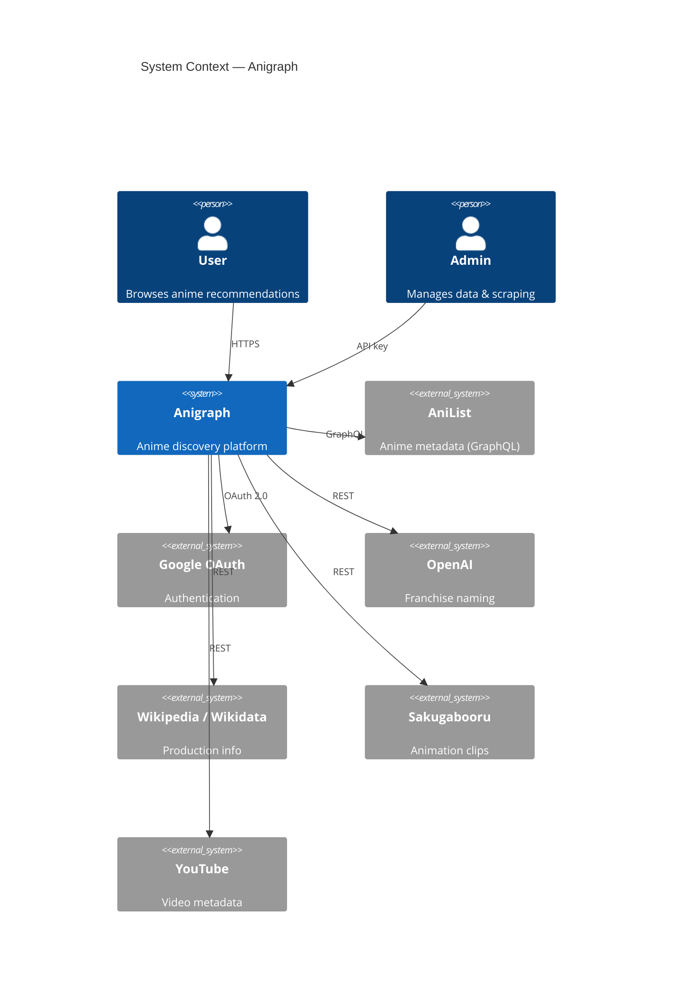
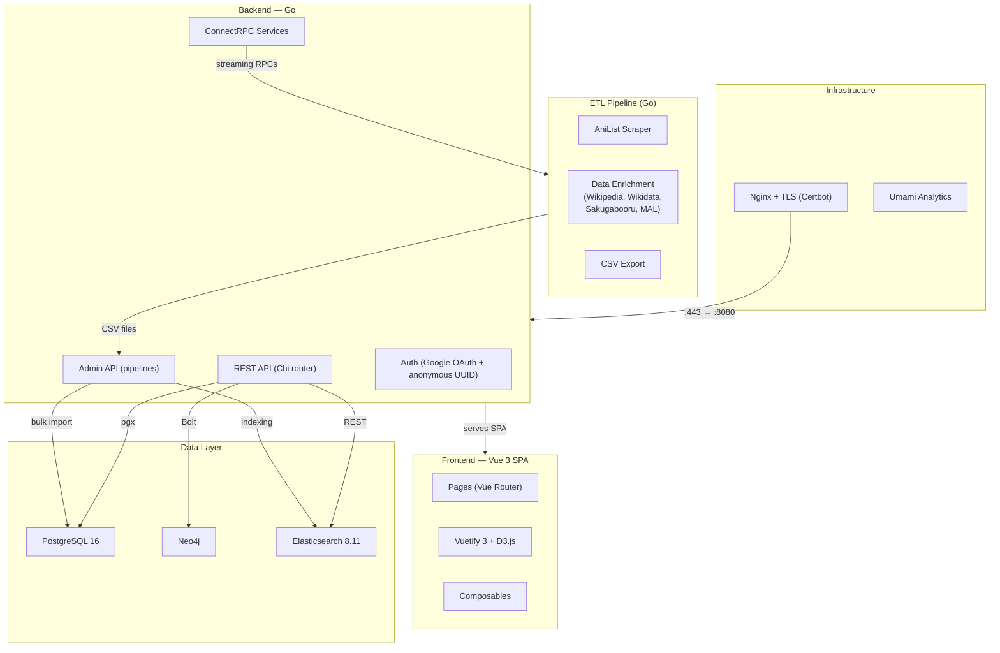
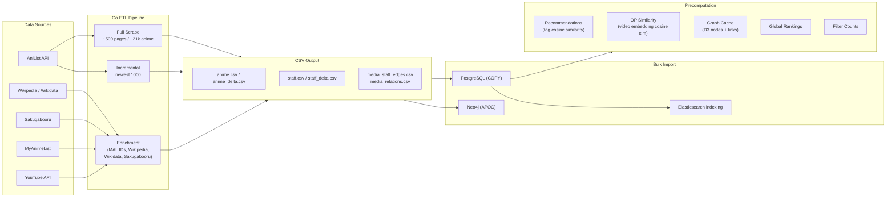
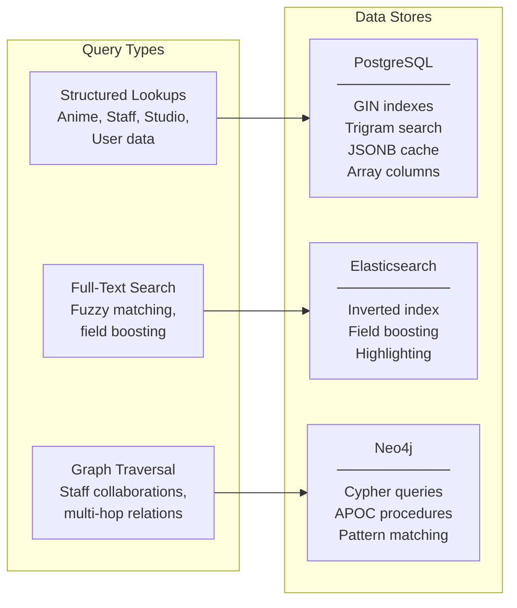
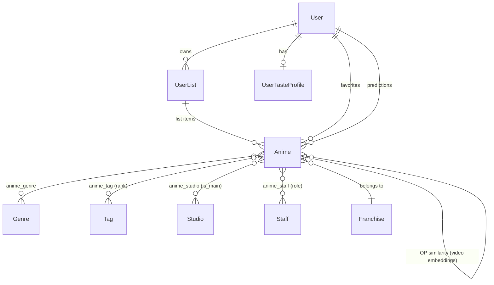
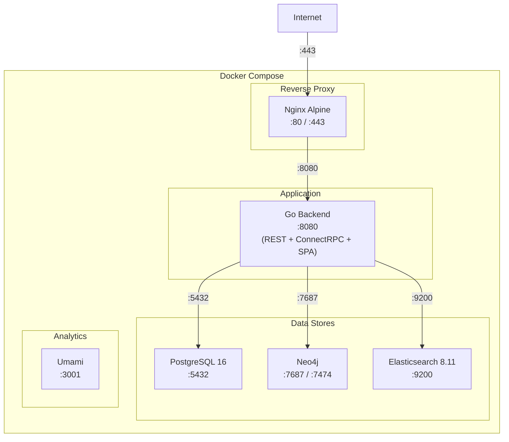

# Anigraph — Architecture

## System Context

## High-Level Architecture

## Technology Stack

| Layer | Technology | Purpose |
|-------|-----------|---------|
| **Frontend** | Vue 3, Vue Router, Vuetify 3 | SPA UI framework & component library |
| **Visualization** | D3.js | Force-directed graphs, timelines |
| **Backend** | Go, Chi router | REST API, SPA serving, admin pipelines |
| **RPC** | ConnectRPC (buf) | Streaming ETL orchestration (HTTP/1.1 + JSON compatible) |
| **Primary DB** | PostgreSQL 16 | Structured data, GIN indexes, JSONB cache, array columns |
| **Search** | Elasticsearch 8.11 | Full-text search with field boosting & fuzzy matching |
| **Graph DB** | Neo4j | Staff collaboration networks, graph traversal |
| **Auth** | Google OAuth 2.0 | User authentication (+ anonymous UUID fallback) |
| **AI** | OpenAI (GPT-4o-mini) | Franchise naming |
| **Reverse Proxy** | Nginx + Certbot | TLS termination, static assets |
| **Analytics** | Umami | Privacy-friendly analytics |
| **Containerization** | Docker Compose | Full-stack orchestration |

## ETL Pipeline

## ConnectRPC Services

6 services defined in `proto/anigraph/v1/`:

| Service | RPCs | Streaming |
|---------|------|-----------|
| **ScraperService** | ScrapeIncremental | Server-streaming |
| **PreprocessorService** | PreprocessData | Server-streaming |
| **RecommendationService** | ComputeRecommendations | Server-streaming |
| **EnrichmentService** | 7 RPCs (BackfillMalIds, etc.) | Bidi-stream + unary |
| **SakugabooruService** | MatchTags, FetchPosts | Server-streaming |
| **StudioService** | FetchStudioImages | Server-streaming |

## Polyglot Persistence

## Database Schema (Core Entities)

## Deployment

